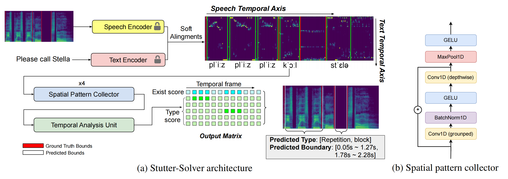

# Stutter-Solver: End-to-end Cross-lingual Dysfluency Detection

## Architecture

## Datasets
We open sourced our three simulated datasets, **VCTK-Art**, **VCTK-Pro** and **AISHELL3-Pro**. Will provide the link soon.
